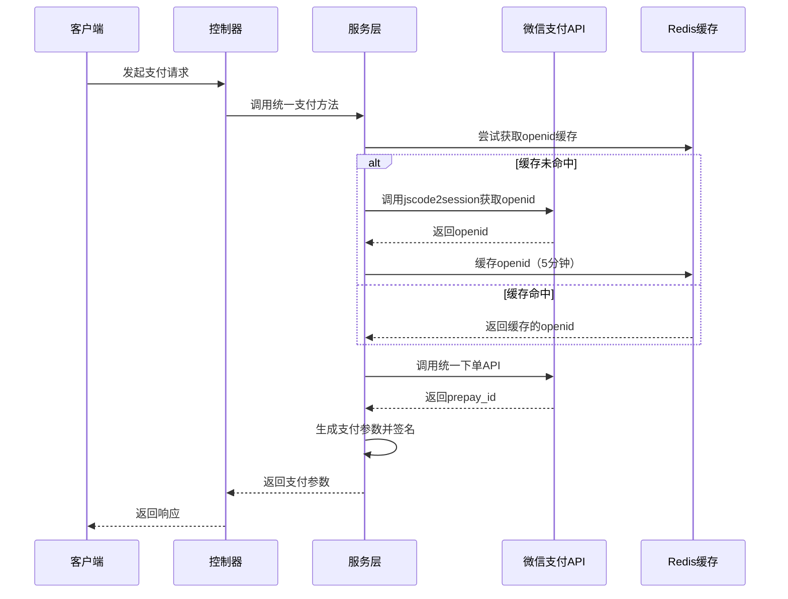
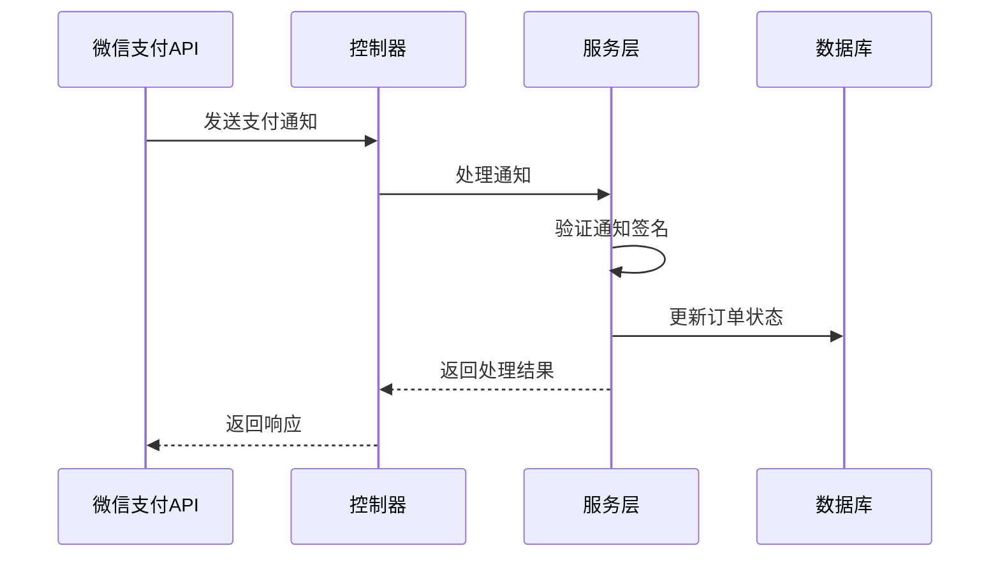

# 支付功能开发流程

## 1. 概述

支付功能是电商系统的核心功能之一，负责处理用户的支付请求、与支付网关交互、管理支付状态等。本项目提供了微信支付功能，并基于此架构实现了裁判支付功能。

## 2. 支付功能架构

### 2.1 架构设计原则

- **分层架构**：控制器层 → 服务层 → 数据访问层
- **业务分离**：不同支付场景（微信支付、裁判支付）独立实现
- **统一接口**：对外提供统一的支付API
- **异步处理**：支付通知采用异步处理机制
- **缓存优化**：对openid等重复请求数据进行缓存

### 2.2 核心组件

```
├── PayController.java       // 支付控制器
├── PayService.java         // 支付服务
├── PaymentParams.java      // 支付参数类
├── PayRepository.java      // 支付数据访问
└── PayResult.java          // 支付结果类
```

## 3. 支付功能开发步骤

### 3.1 需求分析

1. **确定支付场景**：明确需要实现的支付场景（如小程序支付、H5支付、APP支付等）
2. **支付流程设计**：设计完整的支付流程，包括下单、支付、通知、查询、退款等环节
3. **安全考虑**：考虑支付安全性、数据验证、签名机制等
4. **业务集成**：与订单系统、用户系统等进行集成

### 3.2 基础准备

1. **注册支付账号**：在支付提供商平台（如微信支付）注册账号
2. **获取API密钥**：获取支付平台提供的API密钥、商户号等配置信息
3. **配置支付参数**：在项目配置文件中配置支付相关参数
4. **准备证书文件**：获取并配置支付平台的证书文件

### 3.3 代码实现

#### 3.3.1 配置文件修改

在 `application.yml` 中添加支付相关配置：

```yaml
wechat:
  appid: wx6a9f44e2b18a316e
  secret: 36cbae0aa940badbc0ee553b8204a0b5
  pay:
    mchid: 1723914419
    serial_no: 3E3D061F8B9979DE74A58AEADCBD25D6358FFCE8
    notify_url: https://www.ybyoulan.cn:8088/wxpay/notify
    APIv3_key: C5C783DA25F107618073B9F05EA223E6
  cert:
    pub_wechatpay: /opt/cert/wechatpay.pem
    apiclient_key: /opt/cert/apiclient_key.pem
    apiclient_cert: /opt/cert/apiclient_cert.pem
    pub_key: /opt/cert/pub_key.pem
```

#### 3.3.2 控制器层实现

创建支付控制器，处理HTTP请求：

```java
@RestController
@RequestMapping("/referee/pay")
public class RefereePayController {
    
    @Autowired
    private RefereePayService refereePayService;

    @PostMapping("/unified")
    public ResponseEntity<Map<String, String>> unifiedPayment(@RequestBody Map<String, Object> request) {
        // 参数校验
        // 业务逻辑处理
        // 调用支付服务
        // 返回结果
    }
}
```

#### 3.3.3 服务层实现

创建支付服务，处理核心业务逻辑：

```java
@Service
public class RefereePayService {
    
    public Map<String, String> getPaymentParams(String code, String amount, String outTradeNo, String description) {
        // 获取openid
        String openid = getOpenidByCode(code);
        // 获取prepay_id
        String prepayId = getPrepayId(openid, amount, outTradeNo, description);
        // 生成支付参数
        return generatePaymentParams(prepayId);
    }
}
```

#### 3.3.4 支付参数生成与签名

实现支付参数的生成和RSA签名：

```java
private Map<String, String> generatePaymentParams(String prepayId) {
    String timeStamp = String.valueOf(Instant.now().getEpochSecond());
    String nonceStr = generateNonceStr();
    String packageValue = "prepay_id=" + prepayId;
    String signMessage = String.format("%s\n%s\n%s\n%s\n", appId, timeStamp, nonceStr, packageValue);
    String privateKey = loadPrivateKeyFromPem();
    String paySign = sign(signMessage, privateKey);

    Map<String, String> result = new HashMap<>();
    result.put("timeStamp", timeStamp);
    result.put("nonceStr", nonceStr);
    result.put("package", packageValue);
    result.put("paySign", paySign);
    result.put("appId", appId);
    result.put("signType", "RSA");
    
    return result;
}
```

### 3.4 支付通知处理

实现支付通知的接收和处理：

```java
@PostMapping("/notify")
public ResponseEntity<Map<String, String>> payNotify(@RequestBody String notifyData) {
    try {
        refereePayService.handlePayNotify(notifyData);
        return ResponseEntity.ok(Collections.singletonMap("code", "SUCCESS"));
    } catch (Exception e) {
        return ResponseEntity.ok(Collections.singletonMap("code", "FAIL"));
    }
}
```

### 3.5 订单查询与退款

实现订单查询和退款功能：

```java
@PostMapping("/query")
public ResponseEntity<Map<String, Object>> queryOrder(@RequestBody Map<String, Object> request) {
    // 查询订单逻辑
}

@PostMapping("/refund")
public ResponseEntity<Map<String, Object>> refundOrder(@RequestBody Map<String, Object> request) {
    // 退款逻辑
}
```

## 4. 支付功能核心流程

### 4.1 支付下单流程



### 4.2 支付通知流程



## 5. 安全考虑

### 5.1 签名验证

- 使用RSA2048算法进行签名
- 验证支付通知的真实性
- 防止数据篡改和伪造

### 5.2 参数验证

- 验证必填参数的完整性
- 验证参数格式的正确性
- 防止SQL注入等攻击

### 5.3 错误处理

- 统一的异常处理机制
- 详细的错误日志记录
- 友好的错误提示

## 6. 测试与部署

### 6.1 测试环境

1. 使用微信支付沙箱环境进行测试
2. 验证支付流程的完整性
3. 测试各种边界情况

### 6.2 生产部署

1. 配置生产环境的支付参数
2. 部署证书文件到服务器
3. 测试生产环境的支付功能
4. 监控支付系统的运行状态

## 7. 代码优化建议

### 7.1 代码复用

- 提取支付功能的公共方法
- 统一处理支付参数的校验
- 封装API请求和响应处理

### 7.2 性能优化

- 优化支付通知的处理速度
- 改进缓存策略
- 优化数据库查询

### 7.3 安全增强

- 增强签名验证的严格性
- 改进错误处理和日志记录
- 添加支付风险控制机制

## 8. 总结

本项目的支付功能采用了分层架构设计，提供了完整的支付流程支持，包括下单、支付、通知、查询和退款等功能。通过参考微信支付的架构实现了裁判支付功能，确保了支付功能的安全性、可靠性和可扩展性。

在开发过程中，我们遵循了支付功能开发的最佳实践，包括：
- 严格的参数验证
- 安全的签名机制
- 异步通知处理
- 完善的错误处理
- 性能优化策略

这些措施确保了支付功能能够满足高并发、高可用的要求，为用户提供了安全、快捷的支付体验。
